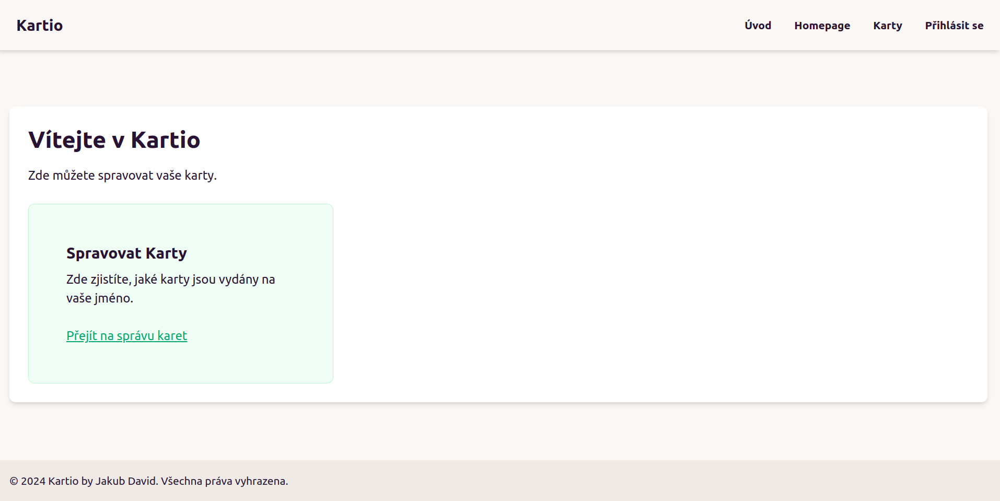

# Kartio - The Loyalty Cards Master

- This app provides a simple way for business to issue loayalty cards for their customers.
- It was created as a university project for web appliactions course.



**Kartio** is a web application designed to help business owners manage their brands and loyalty programs efficiently. It allows business owners to create brands and issue loyalty cards to customers. The application provides an intuitive interface for both business owners and their customers.

# Architecture

## MVC

- Structure of the app is Model-View-Controller
- The app uses Twig as the templating engine `symfony/twig`.

## Design

- Styling is done using Tailwind CSS with preprocessor integrated with Symfony.
- Components are from Daiy UI which is added as a Tailwind plugin. It has to be installed using NPM like this `npm i -D daisyui@latest`

## Database

- Since the author wanted to try MongoDB it was chosen as the main DB.
- The reason is also economical as NoSQL DBs are cheaper to run in the cloud.
- The required composer packages are `mongodb/mongodb` and `doctrine/mongodb-odm-bundle`.
- Instead of ORM it uses ODM but with the same principles as Doctrine ORM.

# Development

- Secrets are only stored in `.env.local`.

## Installation

To install the Kartio application, follow these steps:

1. **Clone the Repository**:

   ```bash
   git clone https://github.com/your-repo/kartio.git
   cd kartio
   ```

2. **Install Dependencies**:

   ```bash
   composer install
   npm install
   ```

3. **Set Up Environment Variables**:

   ```bash
   cp .env.example .env
   # Edit the .env file to add your database and OAuth credentials
   ```

4. **Run Migrations**:

   ```bash
   php bin/console doctrine:migrations:migrate
   ```

5. **Start the Development Server**:
   ```bash
   symfony server:start
   ```

## Configuration

### Security Configuration

The security configuration involves setting up user providers, firewalls, and access control rules. The `security.yaml` file is configured to handle user authentication, including GitHub OAuth.

```yaml
security:
  providers:
    hwi:
      id: App\Security\MyEntityUserProvider

  firewalls:
    dev:
      pattern: ^/(_(profiler|wdt)|css|images|js)/
      security: false

    main:
      anonymous: ~
      oauth:
        resource_owners:
          github: "/login/check-github"
        login_path: /login
        use_forward: false
        failure_path: /login

        oauth_user_provider:
          service: App\Security\MyEntityUserProvider

      logout:
        path: /logout
        target: /

      remember_me:
        secret: "%kernel.secret%"
        lifetime: 604800 # 1 week in seconds
        path: /
        httponly: true

  access_control:
    - { path: ^/login, roles: IS_AUTHENTICATED_ANONYMOUSLY }
    - { path: ^/login/check-github, roles: IS_AUTHENTICATED_ANONYMOUSLY }
    - { path: ^/, roles: ROLE_USER }
```
